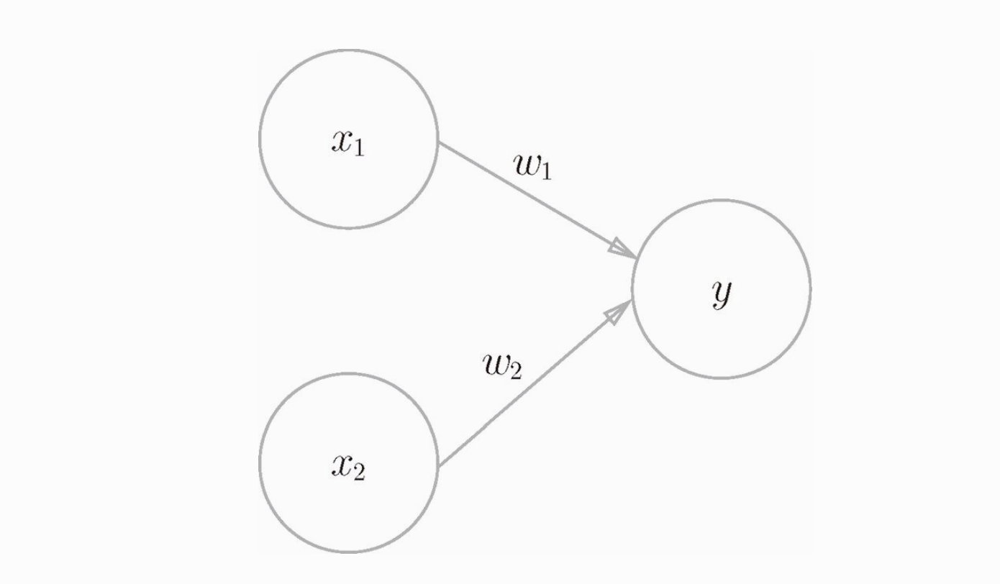
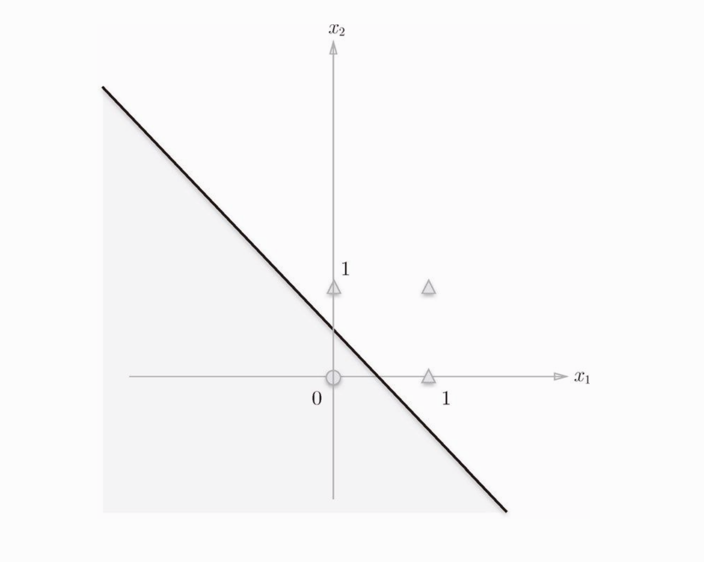
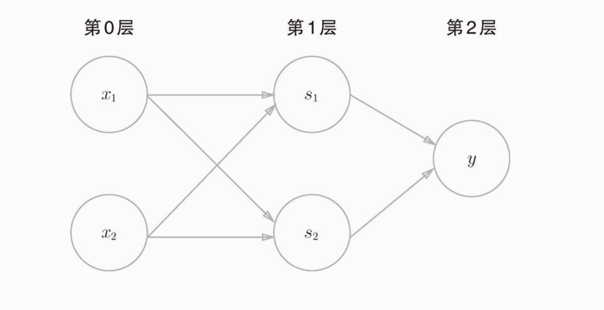

[TOC]

### 感知机(perceptron)

​		感知机也算是神经网络的起源算法了，感知机和神经网络有着重要联系，感知机也可以成为”人工神经元“，神经网络的最小单位

​	感知机接收多个输入信号，输出一个信号。这里所说的“信号”可以想象成电流或河流那样具备“流动性”的东西。像电流流过导线，向前方输送电子一样，感知机的信号也会形成流，向前方输送信息

​																			有两个输入的感知机

​		数学表达式如下
$$
f(x)=\left\{
\begin{aligned}
0 \quad(w_1*x_1+w_2*x_2 )  \le \theta\\
1 \quad(w_1*x_1+w_2*x_2 ) > \theta\\
\end{aligned}
\right.
$$
​			

​		当满足某个条件时，感知机才会有相应，也就是说当运算的结果时大于某个阈值时才会把特定的消息传输到下层，神经元的激活类似于这个算法

#### 感知机的局限性

​		使用感知机可以实现与门、与非门、或门三种逻辑电路,但是有个局限性，实现不了异或门，为什么实现不了异或门呢，因为异或门线性不可分

​		感知机的公式简化后就是一条直线的公式，对于异或这种线性不可分的问题，单个感知机是解决不了的，这就需要多层感知机了

#### 多层感知机

​		感知机的妙处在于他可以叠加，可以用类似于门电路的方式来实现感知机的线形不可分的情况

​		s1表示NAND门电路，s2表示OR门电路，y为AND门电路，，这样的两层结构的感知机可以完美的解决异或问题