[TOC]


### 神经网络

​	 神经网络和感知机有很多共同点。这里，我们主要以两者的差异为中心，来介绍神经网络的结构。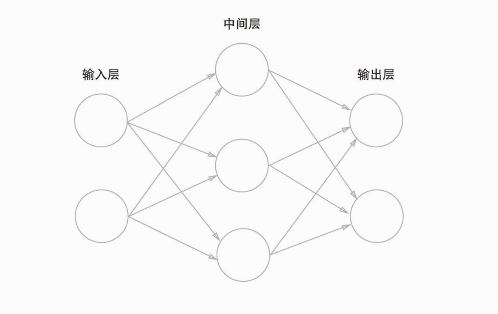

​		神经网络的形状类似上一章的感知机。实际上，就神经元的连接方式而言，与上一章的感知机并没有任何差异。那么，神经网络中信号是如何传递的呢？

​		神经元的传递和感知机基本相似，不同的是神经元里面多了个激活函数，这个神经元可以用下面两条公式表示

$$
a = w_1x_1 + w_2x_2+b \\
y=h(a)
$$
​		其中h(a)为激活函数

#### 激活函数

##### 	sigmoid函数

​		 神经网络中经常使用的一个激活函数就是 sigmoid 函数 （sigmoid function）
$$
h(x) = \frac{1}{1+e^{-x}}
$$
​		神经网络中用 sigmoid 函数作为激活函数，进行信号的转换，转换后的信号被传送给下一个神经元。实际上，感知机和神经网络的主要区别就在于这个激活函数。

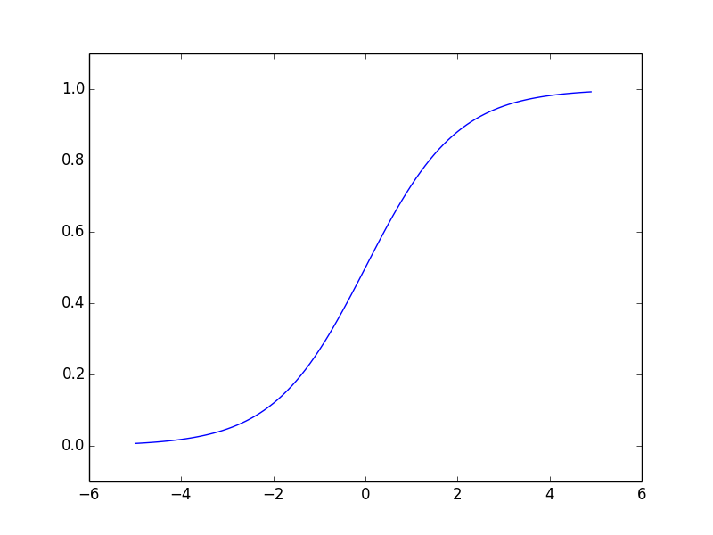

​		感知机是使用了阶跃函数
$$
f(x)=\left\{
\begin{aligned}
0 \quad(w_1x_1+w_2x_2 +b)  \le 0\\
1 \quad(w_1x_1+w_2x_2 +b) > 0\\
\end{aligned}
\right.
$$

```python
sigmoid  ./ch03/sigmoid_function.py
```


##### 	阶跃函数与 sigmoid 函数

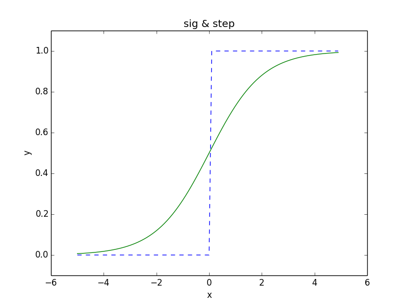

​		首先注意到的是“平滑性”的不同。sigmoid 函数是一条平滑的曲线，输出随着输入发生连续性的变化。而阶跃函数以 0 为界，输出发生急剧性的变化

​		另一个不同点是，相对于阶跃函数只能返回 0 或 1，sigmoid 函数可以返回 0.731 ...、0.880 ... 等实数（这一点和刚才的平滑性有关）。也就是说，感知机中神经元之间流动的是 0 或 1 的二元信号，而神经网络中流动的是连续的实数值信号。

​		阶跃函数和 sigmoid 函数的共同性质。阶跃函数和 sigmoid 函数虽然在平滑性上有差异，但是如果从宏观视角看图 ，可以发现“它们具有相似的形状。实际上，两者的结构均是“输入小时，输出接近 0（为 0）；随着输入增大，输出向 1 靠近（变成 1）”。也就是说，当输入信号为重要信息时，阶跃函数和 sigmoid 函数都会输出较大的值；当输入信号为不重要的信息时，两者都输出较小的值。

​		还有一个共同点是，不管输入信号有多小，或者有多大，输出信号的值都在 0 到 1 之间。

```python
sig_step  ./ch03/sig_step_compare.py
```

​	**非线性函数**

​		阶跃函数和 sigmoid 函数还有其他共同点，就是两者均为非线性函数 。sigmoid 函数是一条曲线，阶跃函数是一条像阶梯一样的折线，两者都属于非线性的函数。

​		神经网络的激活函数必须使用非线性函数。换句话说，激活函数不能使用线性函数。为什么不能“使用线性函数呢？因为使用线性函数的话，加深神经网络的层数就没有意义了。	

这里我们考虑把线性函数 
$$
h (x ) = cx
$$
 作为激活函数，把 
$$
y (x ) = h (h (h (x )))
$$
 的运算对应 3 层神经网络。这个运算会进行 
$$
y (x ) = c * c * c * x
$$
的乘法运算，但是同样的处理可以由 
$$
y (x ) = ax （注意,a = c^3）
$$
这一次乘法运算（即没有隐藏层的神经网络）来表示。也就是说 1 层神经网络，也可以表示 3 层。

##### 	Re_LU函数（Rectified Linear Unit）

​		在神经网络发展的历史上，sigmoid 函数很早就开始被使用了，而最近则主要使用 ReLU 函数

​		ReLU 函数在输入大于 0 时，直接输出该值；在输入小于等于 0 时，输出 0

​	具体属性公式如下
$$
h(x)=\left\{
\begin{aligned}
x\quad(x >0)\\
0\quad(x\le0)
\end{aligned}
\right.
$$
​	ReLU 函数是一个非常简单的函数。

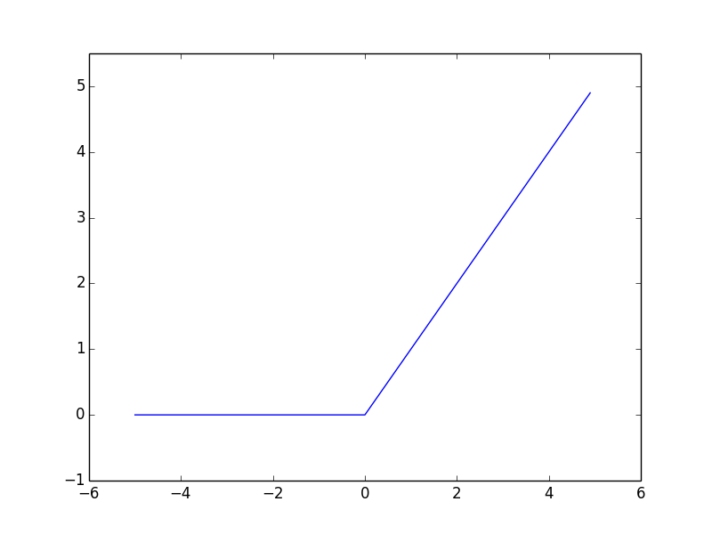

```python
relu  ./ch03/relu.py
```

####  神经网络内积

​		这里我们以下图中的简单神经网络为对象。这个神经网络省略了偏置和激活函数，只有权重。

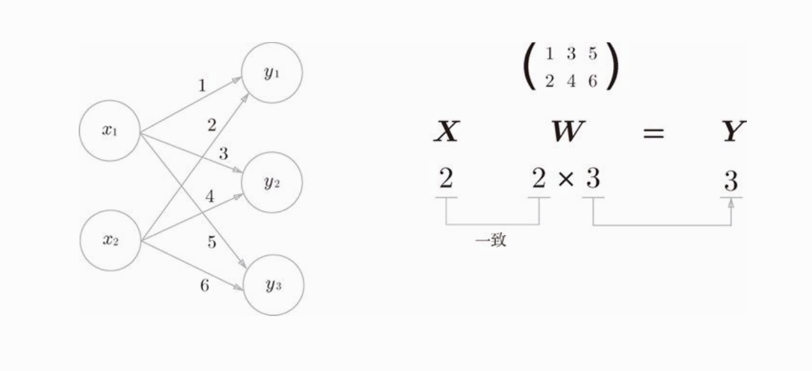

​		实现该神经网络时，要注意 X 、W 、Y 的形状，特别是 X 和 W 的对应维度的元素个数是否一致，这一点很重要

```python
nn_dot_product  ./ch03/nn_dot_product.py
```

#### 3 层神经网络的解析

​		这里我们以图 中 3 层神经网络为对象，实现从输入到输出的（前向）处理

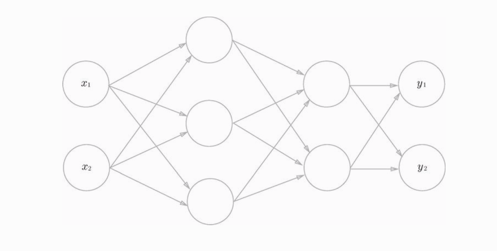

​															3层神经网络

**从输入层到第1层到信号传递**

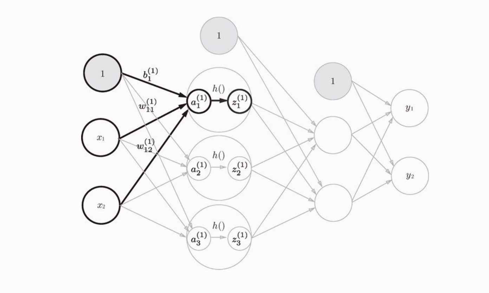

​	如图所示，隐藏层的加权和（加权信号和偏置的总和）用 a 表示，被激活函数转换后的信号用 z 表示。此外，图中 h () 表示激活函数，这里我们使用的是 sigmoid 函数。

​		输入层 1 号神经元
$$
a_1^{(1)} = w_{11}^{(1)}x_1 + w_{12}^{(1)}x_2+b_1^{(1)} \\
z_1^{(1)}=h(a_1^{(1)})
$$
​		输入层 2 号神经元
$$
a_2^{(1)} = w_{21}^{(1)}x_1 + w_{22}^{(1)}x_2+b_2^{(1)} \\
z_2^{(1)}=h(a_2^{(1)})
$$
​		输入层 3 号神经元
$$
a_3^{(1)} = w_{31}^{(1)}x_1 + w_{32}^{(1)}x_2+b_3^{(1)} \\
z_3^{(1)}=h(a_3^{(1)})
$$
**矩阵表示法**
$$
X = (x_1\quad x_2)\\
A^{(1)}=(a_1^{(1)}\quad a_2^{(1)}\quad a_3^{(1)})\\
B^{(1)} =(b_1^{(1)}\quad b_2^{(1)}\quad b_3^{(1)})\\
W^{(1)} = \left(
\begin{aligned}
w_{11}^{(1)}\quad w_{21}^{(1)}\quad w_{31}^{(1)}\\
w_{12}^{(1)}\quad w_{22}^{(1)}\quad w_{32}^{(1)}\\
\end{aligned}
\right)\\
Z^{(1)} = (z_1^{(1)}\quad z_2^{(1)}\quad z_3^{(1)})
$$

---

$$
A^{(1)} = X*W^{(1)} + B^{(1)}\\
Z^{(1)} = h(A^{(1)})
$$

**从第1层到第2层到信号传递**

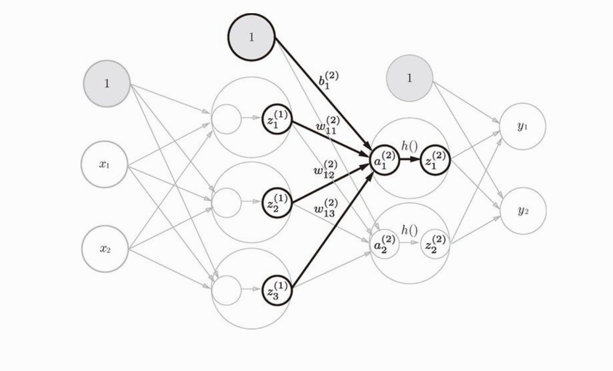

​		除了第 1 层的输出（Z1 ）变成了第 2 层的输入这一点以外，和第1层完全相同。

$$
Z^{(1)} = (z_1^{(1)}\quad z_2^{(1)}\quad z_3^{(1)})\\
A^{(2)}=(a_1^{(2)}\quad a_2^{(2)})\\
B^{(2)} =(b_1^{(2)}\quad b_2^{(2)}\\
W^{(2)} = \left(
\begin{aligned}
w_{11}^{(2)}\quad w_{21}^{(2)}\\
w_{12}^{(2)}\quad w_{22}^{(2)}\\
w_{13}^{(2)}\quad w_{23}^{(2)}\\
\end{aligned}
\right)\\
Z^{(2)} = (z_1^{(2)}\quad z_2^{(2)})
$$

---

$$
A^{(2)} = Z^{(2)}*W^{(2)} + B^{(2)}\\
Z^{(2)} = h(A^{(2)})
$$

**从第2层到输出层到信号传递**

​		最后是第 2 层到输出层的信号传递。输出层的实现也和之前的实现基本相同。不过，最后的激活函数和之前的隐藏层有所不同。


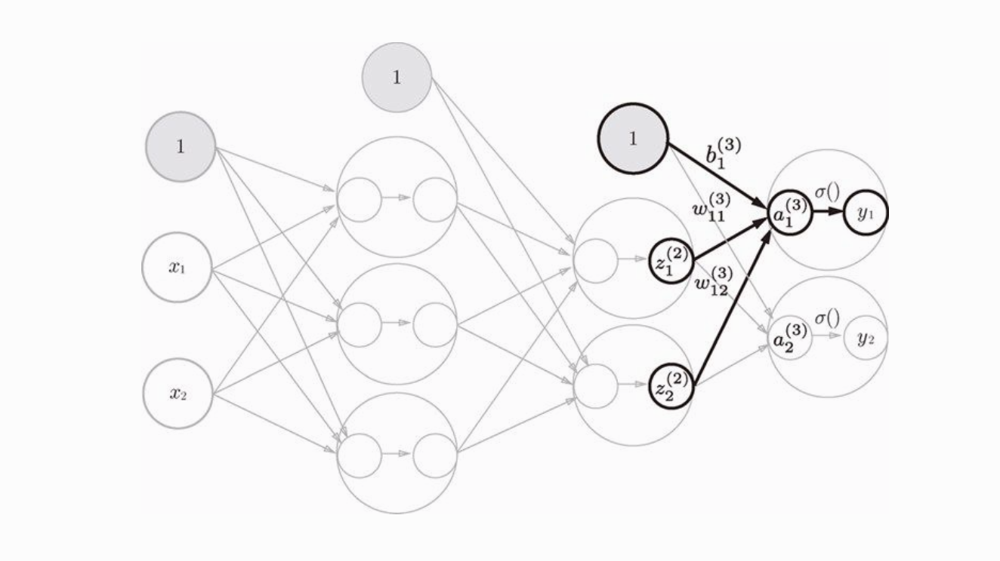

​		另外，图 3-20 中，输出层的激活函数用 σ () 表示，不同于隐藏层的激活函数 h ()（σ 读作 sigma） σ ()  { output = input }

这层的公式如下
$$
Z^{(2)} = (z_1^{(2)}\quad z_2^{(2)})\\
A^{(3)}=(a_1^{(3)}\quad a_2^{(3)})\\
B^{(3)} =(b_1^{(3)}\quad b_2^{(3)})\\
W^{(3)} = \left(
\begin{aligned}
w_{11}^{(3)}\quad w_{21}^{(3)}\\
w_{12}^{(3)}\quad w_{22}^{(3)}\\
\end{aligned}
\right)\\
Y = (y_1\quad y_2)
$$

---

$$
A^{(3)} = Z^{(2)}*W^{(3)} + B^{(3)}\\
Y = \sigma(A^{(3)})
$$

​		输出层所用的激活函数，要根据求解问题的性质决定。一般地，回归问题可以使用恒等函数，二元分类问题可以使用 sigmoid 函数，多元分类问题可以使用softmax 函数.

```python
neural_netword_3  ./ch03/neural_netword_3.py
```

```python
neural_netword_3_plus  ./ch03/neural_netword_3_plus.py
```

#### 输出层的设计

​		神经网络可以用在分类问题和回归问题上，不过需要根据情况改变输出层的激活函数。一般而言，回归问题用恒等函数，分类问题用 softmax 函数。

##### 	恒等函数和 softmax 函数

​		恒等函数会将输入按原样输出，对于输入的信息，不加以任何改动地直接输出。因此，在输出层使用恒等函数时，输入信号会原封不动地被输出。

​		分类问题中使用的 softmax 函数可以用下面的式
$$
y_k = \frac{e^{a_k}}{\sum_{i=1}^{n}e^{a_i}}
$$

$$
表示假设输出层共有 n 个神经元，计算第 k 个神经元的输出y_k\\softmax 函数的分子是输入信号 a_k的指数函数，分母是所有输入信号的指数函数的和。
$$

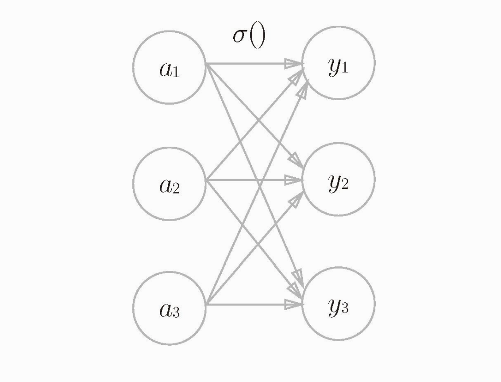

```
softmax  ./ch03/softmax.py
```

### 神经网络的学习

#### 损失函数

​		神经网络的学习中所用的指标称为损失函数 （loss function）。这个损失函数可以使用任意函数，但一般用均方误差和交叉熵误差等。

​	损失函数是表示神经网络性能的“恶劣程度”的指标，即当前的神经网络对监督数据在多大程度上不拟合，在多大程度上不一致。以“性能的恶劣程度”为指标可能会使人感到不太自然，但是如果给损失函数乘上一个负值，就可以解释为“在多大程度上不坏”，即“性能有多好”。并且，“使性能的恶劣程度达到最小”和“使性能的优良程度达到最大”是等价的，不管是用“恶劣程度”还是“优良程度”，做的事情本质上都是一样的。

##### 均方误差

​		
$$
E=\frac{1}{2}\sum_{k}(y_k-t_k)^2
$$

$$
y_k是表示神经网络的输出，t_k表示监督数据，k 表示数据的维数
$$

##### 交叉熵误差

​		
$$
E=-\sum_{k}t_k\log{y_k}
$$

$$
这里，\log 表示以e为底数的自然对数（ \log_{e}）。y_k是神经网络的输出，t_k是正确解标签。\\并且，中只有正确解标签的索引为 1，其他均为 0（one-hot 表示）
$$

​		比如，假设正确解标签的索引是“2”，与之对应的神经网络的输出是 0.6，则交叉熵误差是 -log 0.6 = 0.51；若“2”对应的输出是 0.1，则交叉熵误差为 -log 0.1 = 2.30。也就是说，交叉熵误差的值是由正确解标签所对应的输出结果决定的。

自然对数的图像

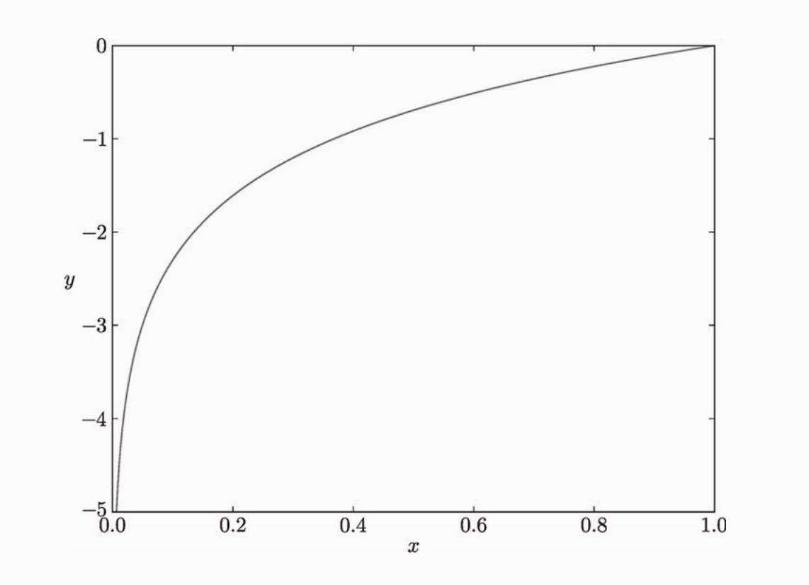


##### Mini-batch 学习

​		机器学习使用训练数据进行学习。使用训练数据进行学习，严格来说，就是针对训练数据计算损失函数的值，找出使该值尽可能小的参数。因此，计算损失函数时必须将所有的训练数据作为对象。也就是说，如果训练数据有 100 个的话，我们就要把这 100 个损失函数的总和作为学习的指标。

​		前面介绍的损失函数的例子中考虑的都是针对单个数据的损失函数。如果要求所有训练数据的损失函数的总和，以交叉熵误差为例，公式如下：

$$
E=-\frac{1}{N}\sum_{n}\sum_{k}t_{nk}\log{y_{nk}}
$$

$$
假设数据有 N 个， 表示第 n 个数据的第 k 个元素的值（y_{nk}是神经网络的输出,t_{nk}是监督数据）。\\式子虽然看起来有一些复杂，其实只是把求单个数据的损失函数的扩大到了 N份数据，\\不过最后还要除以 N 进行正规化。
$$

​		通过除以 N ，可以求单个数据的“平均损失函数”。通过这样的平均化，可以获得和训练数据的数量无关的统一指标。比如，即便训练数据有 1000 个或 10000 个，也可以求得单个数据的平均损失函数。

**为何要设损失函数**

​		在神经网络的学习中，寻找最优参数（权重和偏置）时，要寻找使损失函数的值尽可能小的参数。为了找到使损失函数的值尽可能小的地方，需要计算参数的导数（确切地讲是梯度），然后以这个导数为指引，逐步更新参数的值。

​		假设有一个神经网络，现在我们来关注这个神经网络中的某一个权重参数。此时，对该权重参数的损失函数求导，表示的是“如果稍微改变这个权重参数的值，损失函数的值会如何变化”。如果导数的值为负，通过使该权重参数向正方向改变，可以减小损失函数的值；反过来，如果导数的值为正，则通过使该权重参数向负方向改变，可以减小损失函数的值。不过，当导数的值为 0 时，无论权重参数向哪个方向变化，损失函数的值都不会改变，此时该权重参数的更新会停在此处。

​		之所以不能用识别精度作为指标，是因为这样一来绝大多数地方的导数都会变为 0，导致参数无法更新。话说得有点多了，我们来总结一下上面的内容。

​	在进行神经网络的学习时，不能将识别精度作为指标。因为如果以识别精度为指标，则参数的导数在绝大多数地方都会变为0。“为什么用识别精度作为指标时，参数的导数在绝大多数地方都会变成 0 呢？为了回答这个问题，我们来思考另一个具体例子。假设某个神经网络正确识别出了 100 笔训练数据中的 32 笔，此时识别精度为 32 %。如果以识别精度为指标，即使稍微改变权重参数的值，识别精度也仍将保持在 32 %，不会出现变化。也就是说，仅仅微调参数，是无法改善识别精度的。即便识别精度有所改善，它的值也不会像 32.0123 ... % 这样连续变化，而是变为 33 %、34 % 这样的不连续的、离散的值。而如果把损失函数作为指标，则当前损失函数的值可以表示为 0.92543 ... 这样的值。并且，如果稍微改变一下参数的值，对应的损失函数也会像 0.93432 ... 这样发生连续性的变化。
​		识别精度对微小的参数变化基本上没有什么反应，即便有反应，它的值也是不连续地、突然地变化。作为激活函数的阶跃函数也有同样的情况。出于相同的原因，如果使用阶跃函数作为激活函数，神经网络的学习将无法进行。阶跃函数的导数在绝大多数地方（除了 0 以外的地方）均为 0。也就是说，如果使用了阶跃函数，那么即便将损失函数作为指标，参数的微小变化也会被阶跃函数抹杀，导致损失函数的值不会产生任何变化。

​		阶跃函数就像“竹筒敲石”一样，只在某个瞬间产生变化。而 sigmoid 函数，不仅函数的输出（竖轴的值）是连续变化的，曲线的斜率（导数）也是连续变化的。也就是说，sigmoid 函数的导数在任何地方都不为 0。这对神经网络的学习非常重要。得益于这个斜率不会为 0 的性质，神经网络的学习得以正确进行。

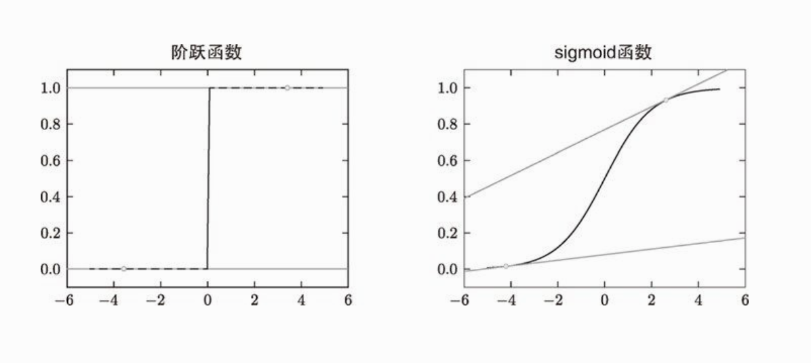

#### 数值微分

##### 导数

​		导数就是表示某个瞬间的变化量。它可以定义成下面的式子。

$$
\frac{df(x)}{dx}=\lim_{\vartriangle x \to 0}\frac{f(x+\vartriangle x)-f(x)}{\vartriangle x}
$$

**例子**
$$
y=0.01x^2+0.1x\\
y' = 0.02x+0.1
$$


```
gradient_1d  ./ch04/gradient_1d.py
```

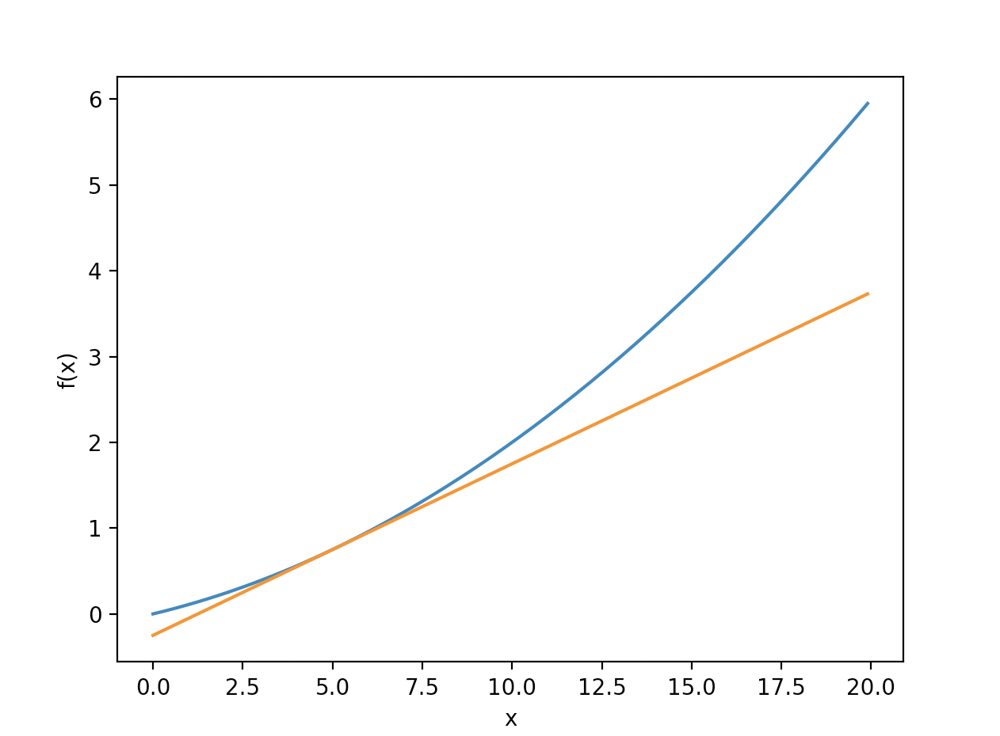

##### 偏导数

$$
f(x_0,x_1) = x_0^2+x_1^2
$$

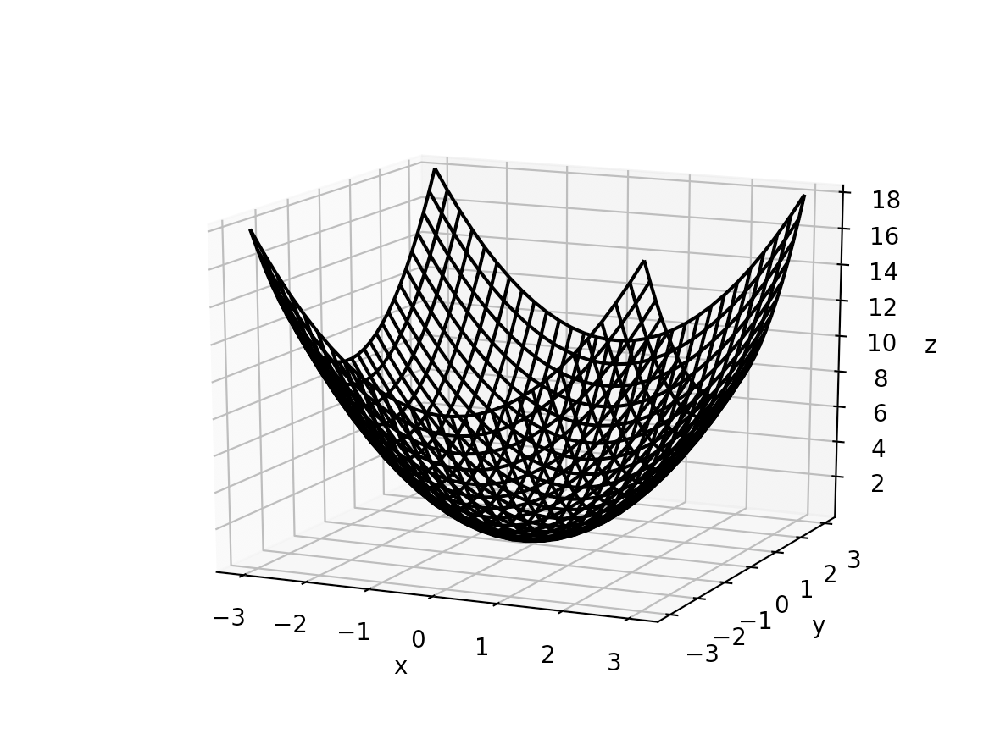

```
gradient_plot ./ch04/gradient_plot.py
```

$$
问题一：求x_0=3，x_1=4时，关于x_0的偏导数\frac{\partial f}{\partial x_0}\\
f(x_0,x_1) = x_0^2+x_1^2\\
\frac{\partial f(x_0,x_1)}{\partial x_0}=2x_0\\
当x_0= 3时\\
\frac{\partial f(x_0,x_1)}{\partial x_0}=2*3=6\\
$$

#### 梯度

$$
\left(
\begin{aligned}
\frac{\partial f}{\partial x_0},\frac{\partial f}{\partial x_1}
\end{aligned}
\right)\\
$$

像这样的由全部变量的偏导数汇总而成的向量称为梯度 （gradient） 

像这样，我们可以计算在各点处的梯度。上例中，点 (3, 4) 处的梯度是 (6, 8)、点 (0, 2) 处的梯度是 (0, 4)、点 (3, 0) 处的梯度是 (6, 0)。这个梯度意味着什么呢?

为了更好的理解，把梯度可视化

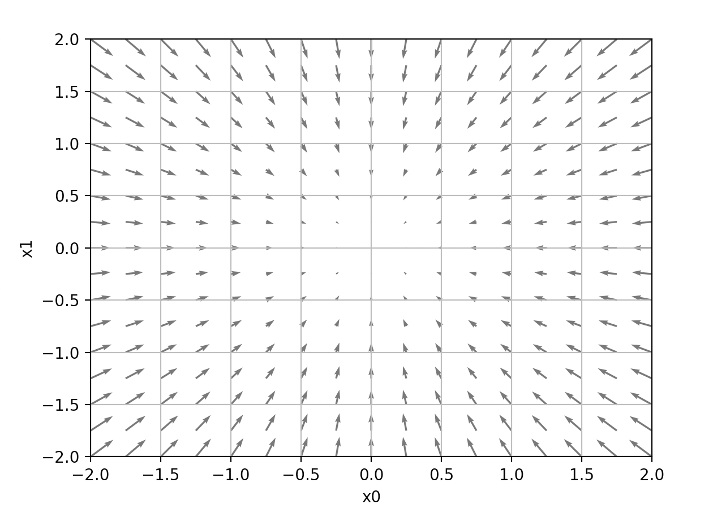

​		我们发现梯度指向函数的“最低处（最小值），就像指南针一样，所有的箭头都指向同一点。其次，我们发现离“最低处”越远，箭头越大。

​		虽然图 4-9 中的梯度指向了最低处，但并非任何时候都这样。实际上，梯度会指向各点处的函数值降低的方向。更严格地讲，梯度指示的方向是各点处的函数值减小最多的方向  。这是一个非常重要的性质。

##### 梯度法

​		机器学习的主要任务是在学习时寻找最优参数。同样地，神经网络也必须在学习时找到最优参数（权重和偏置）。这里所说的最优参数是指损失函数取最小值时的参数。但是，一般而言，损失函数很复杂，参数空间庞大，我们不知道它在何处能取得最小值。而通过巧妙地使用梯度来寻找函数最小值（或者尽可能小的值）的方法就是梯度法。

​		这里需要注意的是，梯度表示的是各点处的函数值减小最多的方向。因此，无法保证梯度所指的方向就是函数的最小值或者真正应该前进的方向。实际上，在复杂的函数中，梯度指示的方向基本上都不是函数值最小处。

 　	函数的极小值、最小值以及被称为鞍点 （saddle point）的地方，梯度为 0。也就是说梯度为0 的点不一定是最优的点，它有可能是局部最优，未必是全局最优。

​		在梯度法中，函数的取值从当前位置沿着梯度方向前进一定距离，然后在新的地方重新求梯度，再沿着新梯度方向前“进，如此反复，不断地沿梯度方向前进。像这样，通过不断地沿梯度方向前进，逐渐减小函数值的过程就是梯度法 （gradient method）。梯度法是解决机器学习中最优化问题的常用方法，特别是在神经网络的学习中经常被使用。

用数学式子来表示上面函数的参数更新：
$$
x_0 = x_0-\eta\frac{\partial f}{\partial x_0}\\
x_1 = x_1-\eta\frac{\partial f}{\partial x_1}
$$
η 表示更新量，在神经网络的学习中，称为学习率 （learning rate）

##### 神经网络的梯度

​		神经网络的梯度是指损失函数关于权重参数的梯度。例如下面的例子：
$$
W=\left(
\begin{aligned}
w_{11}\quad w_{12} \quad w_{13}\\
w_{21}\quad w_{22} \quad w_{23}\\
\end{aligned}
\right)\\
\frac{\partial L}{\partial W} = \left(
\begin{aligned}
\frac{\partial L}{\partial w_{11}}\quad \frac{\partial L}{\partial w_{12}}\quad \frac{\partial L}{\partial w_{13}}\\
\frac{\partial L}{\partial w_{21}}\quad \frac{\partial L}{\partial w_{22}}\quad \frac{\partial L}{\partial w_{23}}
\end{aligned}
\right)
$$

$$
\frac{\partial L}{\partial W}的元素由各个元素关于 W 的偏导数构成。\\比如，第 1 行第 1 列的元素 \frac{\partial L}{\partial w_{11}} 表示当 w_{11} 稍微变化时，损失函数 L 会发生多大变化。\\这里的重点是， W的形状和 \frac{\partial L}{\partial W} 相同。
$$

```
gradient_simplynet ./ch04/gradient_simplynet.py		
```

​		求出梯度后，剩下的只要更新权重参数即可。

​		神经网络的学习分为4个步骤

​	**步骤一** （mini-batch）

​		从训练集随机选取一部分数据，这部分数据称为mini-batch。目标就是为了减小mini-batch的值

​	**步骤二**（计算梯度）

​		为了减小mini-batch的损失函数值，需要求出各个权重参数的梯度。梯度表示损失函数的值减小最多的方向。

​	**步骤三**（更新参数）

​		将权重参数沿梯度方向进行微小更新。

​	**步骤四**（重复）

​		重复步骤1，2，3

​		因为这里使用的数据是随机选择的mini batch 数据，所以又称为**随机梯度下降法** （stochastic gradient ）
